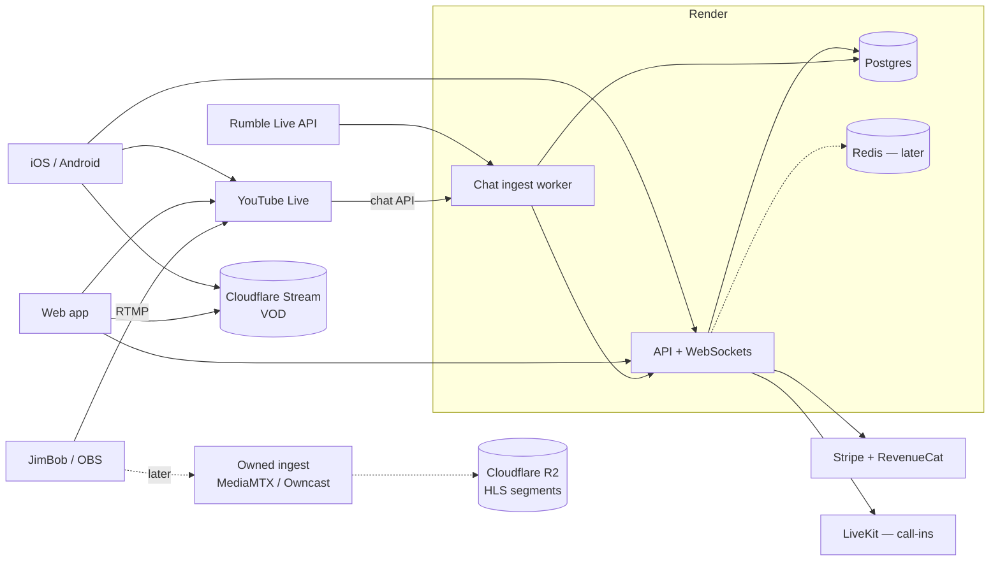

# Architecture — MadeByJimBob

## Principles

1. **Own the core, rent the edges.** Accounts, chat history, members, and payments live in our Postgres. Video delivery and distribution platforms are swappable.
2. **One chat model for every source.** YouTube, Rumble, and native messages share one table and one feed. `offset_ms` ties every message to a point in the video.
3. **Server decides access.** Tier checks and signed URLs happen on the server.
4. **Start simple, scale by seams.** One Render service today; split out the chat ingest worker and add Redis when load or deployment needs require it.

## System overview

## Components

| Component | Tech | Responsibility |
|---|---|---|
| API server | Node, Express, `ws` | REST API, WebSocket chat rooms, serves web build |
| Chat ingest worker | Node (same repo, separate Render worker) | Polls YouTube/Rumble live chat, writes to Postgres, publishes to API |
| Database | Postgres (Render) | System of record: users, videos, chat, entitlements, XP |
| Pub/sub + rate limits | Redis / Render Key Value (Phase 3+) | Cross-instance chat fan-out, rate limiting, vote counters |
| VOD | Cloudflare Stream | Upload, transcode, HLS delivery, thumbnails, captions |
| Owned live (later) | MediaMTX or Owncast → Cloudflare R2 | Live HLS without platform dependency; audio-only rendition |
| Web | React + Vite | Viewer app and Studio |
| Mobile | Expo + expo-video | iOS/Android with background audio and PiP |
| Payments | Stripe (web), RevenueCat (unifies Stripe/Apple/Google) | Subscriptions, tips |
| Call-ins | LiveKit | Green room and caller media into OBS |
| AI jobs | Whisper (captions), Claude API (recaps, chat analysis, moderation assist) | Batch jobs after each stream |

## Phases

| Phase | Goal | Key outcomes |
|---|---|---|
| **0 — Foundation** | Make the POC a safe base to build on | Tests, lint, CI, migrations, TypeScript decision |
| **1 — VOD platform** | Launchable stored-video product | Real auth, tiers + Stripe, signed URLs, moderation, upvotes, Studio auth |
| **2 — Mobile** | App store presence | Expo app with player, background audio, PiP, gestures, IAP |
| **3 — Live via YouTube** | Watch live in-platform with unified chat | Live detection, chat ingest worker, posting to YouTube, Rumble ingest, auto-archive to Stream |
| **4 — Owned live + audio** | Platform independence | Owned ingest to R2, audio-only rendition, podcast feeds |
| **5 — Engagement** | Community stickiness | XP/levels/badges, recaps, analytics, call-ins, native tips |

Phases 2 and 3 can run in parallel once Phase 1 auth and entitlements are done.

## Key flows

### Stored video with chat replay (built)
1. Import script pulls video + chat replay via yt-dlp, uploads video to Stream, bulk-inserts chat.
2. Watch page loads chat in 2-minute windows around the playhead.
3. Native posts are stored at the viewer's current `offset_ms` and broadcast to the video's WebSocket room.

### Live via YouTube (Phase 3)
1. Worker detects the broadcast is live (`liveBroadcasts.list`, owner OAuth) and creates a `videos` row with `status = live`.
2. Clients embed the YouTube player and join the video's chat room.
3. Worker polls `liveChatMessages.list` and inserts each message with `offset_ms = publishedAt − actualStartTime`, then publishes to the room.
4. Native posts go to our chat; linked YouTube accounts can also post to YouTube.
5. When the broadcast ends, a job downloads the VOD, uploads it to Stream, and flips the row to `status = archived`. The live chat is already stored, so replay works immediately.

### Entitlements
Stripe (web) and Apple/Google (mobile) → RevenueCat → webhook → `entitlements` row → tier on the user. The API reads the tier from Postgres only.

## Scaling notes

- One Node instance handles 1,000 WebSocket connections comfortably.
- Moving to multiple instances requires Redis pub/sub for room fan-out and Redis-backed rate limits (MBJ-205).
- Chat writes from ingest are batched; reads are windowed by `(video_id, offset_ms)` index.

## Cost drivers

- **Cloudflare Stream:** billed per minute stored and per minute delivered. Fine for VOD; revisit for live at scale (Phase 4 moves live to R2, which has no egress fees).
- **YouTube API quota:** reading live chat and especially posting consume quota; request an increase early (MBJ-306).
- **Render:** web service + worker + Postgres + Key Value.
