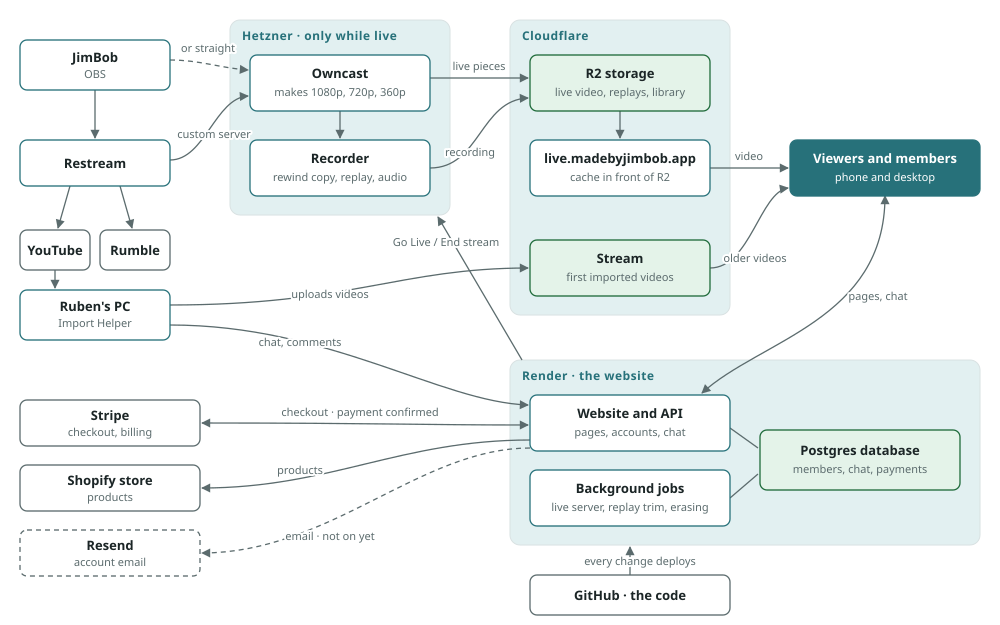

# Architecture — MadeByJimBob

## Principles

1. **Own the core, rent the edges.** Accounts, chat history, members, and payments live in our Postgres. Video delivery and distribution platforms are swappable.
2. **One chat model for every source.** YouTube, Rumble, and native messages share one table and one feed. `offset_ms` ties every message to a point in the video.
3. **Server decides access.** Tier checks and signed URLs happen on the server.
4. **Start simple, scale by seams.** One Render service today; split out the chat ingest worker and add Redis when load or deployment needs require it.

## System overview (as running, 2026-10-04)

Solid lines are running; dashed ones aren't switched on yet. Source: `docs/system-map.svg` (hand-drawn SVG; edit the
coordinates there).

Planned and not shown: YouTube/Rumble live chat merged in (MBJ-301), the OBS super chat overlay (MBJ-223), store apps
(ADR-008), a second web instance with Redis (MBJ-205). A styled version of this map is on the strategy meeting page.

## Components

| Component | Tech | Responsibility |
|---|---|---|
| API server | Node 22, Express, `ws`, Better Auth | REST API, WebSocket chat rooms, serves the web build, Stripe/Resend webhooks |
| Background jobs | Same process (timers) | Live server job (start, configure, End stream drain, idle/cap delete), replay trim (MBJ-312), account erasure, YouTube link matching |
| Database | Postgres (Render), node-pg-migrate | System of record: users, videos, chat, comments, memberships, super chats, payment events |
| Owned live | Owncast + recorder (docker) on a Hetzner CPX31 per stream | RTMP in, HLS ladder to R2; recorder builds the rewind copy, replay and audio (ADR-004) |
| Video storage | Cloudflare R2 behind `live.madebyjimbob.app` (cached) | Live pieces, replays, and the library (ADR-010); Cloudflare Stream only for the first imports |
| Web | React 18 + Vite, hls.js | Viewer app, Studio, PWA |
| Payments | Stripe Checkout + Customer Portal (REST, no SDK) | Memberships and super chats; `users.tier` from subscriptions (ADR-013) |
| Email | Resend | Account email (built, not switched on; ADR-012) |
| Import | Import Helper on Ruben's PC (yt-dlp, ffmpeg) | YouTube video, chat replay and comments in; uploads to Stream |
| Mobile (planned) | Wrap the web app or Expo (ADR-008) | Store apps with background audio and downloads |

## Phases

| Phase | Goal | Key outcomes |
|---|---|---|
| **0 — Foundation** | Make the POC a safe base to build on | Tests, lint, CI, migrations, TypeScript decision |
| **1 — VOD platform** | Launchable stored-video product | Real auth, tiers + Stripe, signed URLs, moderation, upvotes, Studio auth |
| **2 — Mobile** | App store presence | Expo app with player, background audio, PiP, gestures, IAP |
| **3 — Live via YouTube** | Watch live in-platform with unified chat | Live detection, chat ingest worker, posting to YouTube, Rumble ingest, auto-archive to Stream |
| **4 — Owned live + audio** | Platform independence | Owned ingest to R2, audio-only rendition, podcast feeds |
| **5 — Engagement** | Community stickiness | XP/levels/badges, recaps, analytics, call-ins, native tips |

Phases 2 and 3 can run in parallel once Phase 1 auth and entitlements are done.

## Key flows

### Stored video with chat replay (built)
1. Import script pulls video + chat replay via yt-dlp, uploads video to Stream, bulk-inserts chat.
2. Watch page loads chat in 2-minute windows around the playhead.
3. Native posts are stored at the viewer's current `offset_ms` and broadcast to the video's WebSocket room.

### Live via YouTube (Phase 3)
1. Worker detects the broadcast is live (`liveBroadcasts.list`, owner OAuth) and creates a `videos` row with `status = live`.
2. Clients embed the YouTube player and join the video's chat room.
3. Worker polls `liveChatMessages.list` and inserts each message with `offset_ms = publishedAt − actualStartTime`, then publishes to the room.
4. Native posts go to our chat; linked YouTube accounts can also post to YouTube.
5. When the broadcast ends, a job downloads the VOD, uploads it to Stream, and flips the row to `status = archived`. The live chat is already stored, so replay works immediately.

### Entitlements
Stripe (web) and Apple/Google (mobile) → RevenueCat → webhook → `entitlements` row → tier on the user. The API reads the tier from Postgres only.

## Scaling notes

- One Node instance handles 1,000 WebSocket connections comfortably.
- Moving to multiple instances requires Redis pub/sub for room fan-out and Redis-backed rate limits (MBJ-205).
- Chat writes from ingest are batched; reads are windowed by `(video_id, offset_ms)` index.

## Cost drivers

- **Cloudflare Stream:** billed per minute stored and per minute delivered. Fine for VOD; revisit for live at scale (Phase 4 moves live to R2, which has no egress fees).
- **YouTube API quota:** reading live chat and especially posting consume quota; request an increase early (MBJ-306).
- **Render:** web service + worker + Postgres + Key Value.
