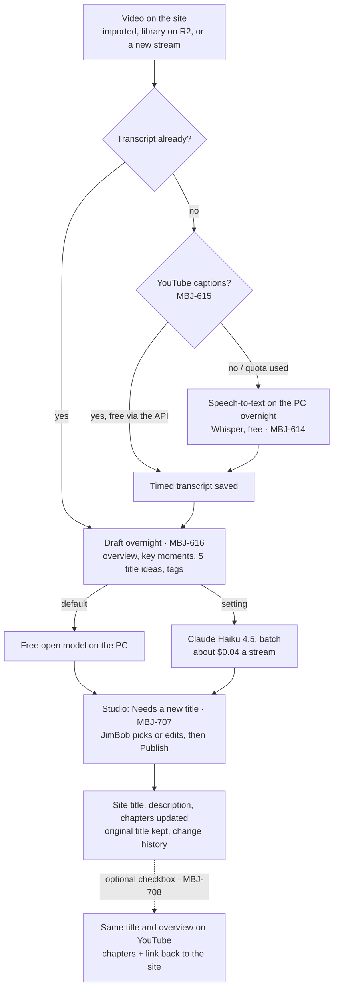

# Retitling the library — flow

JimBob's YouTube titles don't say what each stream is about. Every video gets a transcript, a short overview with key
moments, and a new, catchy title, about 1-2 videos a day over 1-3 years. Nothing here is built yet; the stories are
MBJ-614, 615, 616, 707 and 708 (MBJ-708 optional). Cheapest path first: free captions and free models on a PC
overnight, paid only as a fallback.

## Step by step

1. **Queue.** Every video without a transcript joins the overnight queue: newest first, or "Do this one next" from
   Studio. Runs on the PC that already does imports (or JimBob's, with the Library Uploader), in a window set in Studio
   (default 11pm-7am). Stopping and restarting picks up where it left off.
2. **Transcript (free).** First anything already stored (Cloudflare Stream captions on the first imports), then YouTube's
   own captions through the official API once JimBob connects his channel (about 50 a day free), then Whisper on the PC.
   A 4-hour stream: roughly 20-60 minutes with an NVIDIA card, several hours on the processor alone.
3. **Draft (free by default).** A free open model on the same PC reads the transcript in parts and writes the overview,
   key moments with timestamps, 5 title options (punchy, under ~70 characters) and tags. If its titles aren't good
   enough, a Studio setting switches to Claude Haiku 4.5 through the Batch API: about $0.04 per 4-hour stream, ~$35 for
   all 926 videos. Drafts never change anything published.
4. **Retitle in Studio.** JimBob opens "Needs a new title", sees the options next to the searchable transcript, picks or
   writes a title, edits the overview and moments, and presses Publish. The site changes at once; the original YouTube
   title stays (smaller, still searchable); every change can be undone.
5. **YouTube (optional).** With "Also update on YouTube" ticked, the same title and overview go to the video on YouTube,
   with the key moments as chapters and a link to the site. The old YouTube text is saved first.

## Costs

| Piece | Cost |
|---|---|
| Transcripts (captions, Whisper on the PC) | $0 |
| Drafts with a free model on the PC | $0 |
| Drafts with Claude Haiku 4.5 (batch), if chosen | ~$0.04 per 4-hour stream; at 1-2 a day, ~$1-3 a month |
| YouTube updates | $0 (inside the free API quota) |

## Needs before building

- A PC that can run overnight (Ruben's import PC works; an NVIDIA card makes it several times faster).
- JimBob connects his YouTube channel once (MBJ-615, also used by MBJ-708).
- For the paid fallback only: an Anthropic API key on the PC or on Render (`ANTHROPIC_API_KEY`).
